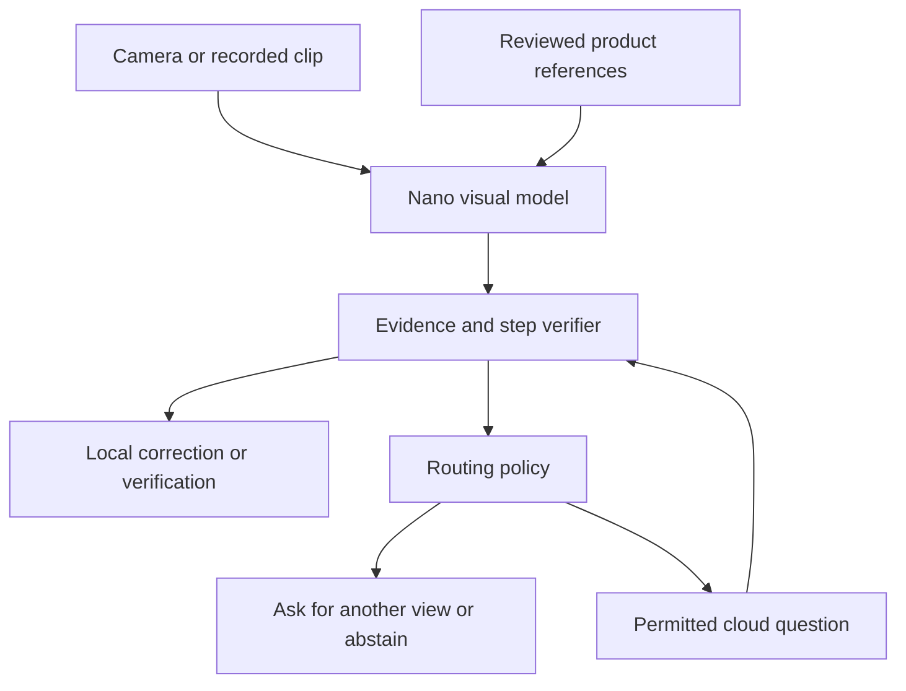

# AssemLens

**See the step. Catch the mismatch. Verify the fix.**

AssemLens, formerly WatchFix, is an edge-first visual assembly assistant. A product QR code would load a supported instruction/reference package; a camera observes the workspace; the system checks progress, gives short corrections and verifies the corrected state. Workspace analysis runs on an HP ZGX Nano, with selective cloud escalation when evidence remains unresolved and the user permits it.

Built for the SJSU / HP Edge AI hackathon by **Akash, Pramod, Kavan, Shruthi and Denisha**.

## Current status

This is an early engineering baseline, not a finished assembly-verification product.

| Component | Status |
|---|---|
| Qwen3-VL-4B BF16 LoRA training worker | Implemented; HP GPU pilot required |
| Assembly101 selective authenticated downloads | Implemented in notebook; user must accept dataset access conditions |
| Before/after action-recognition validation | Implemented; no measured results committed yet |
| Deterministic edge/cloud routing policy | Implemented and unit tested; cloud client not connected |
| Repeated-capture step-verification gate | Implemented and unit tested; requires visual-model integration |
| Frontend, QR/product-ID lookup and Nano API | Implemented for preview and experimental live comparison; reviewed product references required for guided checks |
| Cloud endpoint | Planned |
| HP hardware / PC assembly support | Planned; product template only |

The [frontend](frontend/README.md) runs from the [Nano API](docs/nano_api.md). Preview results are simulated. Live comparison sends a user-selected reference and current photo to the base Qwen3-VL model on the Nano; it is experimental and does not automatically advance a step. No reviewed jeep product package is included yet.

**The current training task recognizes an assembly action from two frames. It does not yet judge whether furniture or a PC is assembled correctly.** The next model experiment needs product-specific state/error labels and reference images.

## Run on the HP tonight

Use the VS Code Remote SSH window connected to your assigned Nano. Activate the HP-provided Python environment whose CUDA test works. Do not replace its PyTorch build with desktop x86 packages.

```bash
git clone https://github.com/Akashkumarsenthil/assemlens.git
cd assemlens
bash scripts/setup_hp.sh
```

Open [`notebooks/AssemLens_HP_Overnight.ipynb`](notebooks/AssemLens_HP_Overnight.ipynb), select **Python (AssemLens HP)**, and run in order:

1. Check the actual GPU, BF16 support, disk space and FFmpeg.
2. Accept Assembly101's Hugging Face conditions and authenticate with a read token.
3. Select/download a bounded subset, then inspect sample frames and labels.
4. Run the two-step pilot. Fix errors before launching a long run.
5. Launch the detached training worker and monitor its status/log.
6. Compare baseline and adapted outputs on the same held-out recording subset.

The notebook references the checked-in worker, so the repo is the source of truth. Keep `scripts/` next to `notebooks/`. FFmpeg setup is explained inside the notebook. There is no paid model API in this training path. The six-hour limit applies to training, not downloads or evaluation. Keep the HP powered on; coordinate GPU/network use with teammates.

Default: 4 train + 2 validation recordings, 80 segments each, two frames, rank-16 language-attention LoRA, microbatch 1, accumulation 8, two epochs. The vision encoder and base weights remain frozen. Save adapters, model revision, environment versions and evaluation reports off the Nano before it is wiped.

## Dataset and model

- [Assembly101 official download / access page](https://huggingface.co/datasets/cvml-nus/assembly101)
- [Annotation schema](https://github.com/assembly-101/assembly101-annotations/tree/main/fine-grained-annotations)
- [Qwen3-VL-4B-Instruct](https://huggingface.co/Qwen/Qwen3-VL-4B-Instruct)
- [Download code, license and split details](docs/datasets.md)

Download calls are in the notebook; data is not hosted in this repo. Assembly101 is gated, **CC BY-NC 4.0**, and depicts toy vehicles. Respect the original dataset/model terms. Do not use a full-repository download or commit credentials, videos, weights or private captures.

## Intended architecture



`assemlens/policy.py` contains the implemented decision logic. Unclear views request recapture. Unsupported products abstain. Two unresolved clear observations can trigger escalation only with consent, connectivity and remaining budget. The caller must execute/log requests and deduct budget; a route decision does not call the cloud. A model's confidence statement is not a calibrated probability.

The verifier requires two distinct consecutive complete captures before allowing advancement. The caller hashes actual captured image bytes; duplicate snapshots cannot count twice. These gates cannot compensate for an inaccurate visual model.

## Beyond furniture: PC assembly

A future product package could support customers who buy compatible PC components, including documented **HP hardware upgrades**, and want camera-based guidance while assembling them. Load the exact motherboard/device manual, compatibility list and visual references; check visible component orientation or latches; ask for another angle when uncertain.

This capability is **not trained or validated yet**. An HP-branded desktop is not automatically compatible with arbitrary parts. We do not claim HP endorsement or camera-only electrical/safety certification. See [PC-assembly scope](docs/pc_assembly.md) and the [unvalidated product template](products/pc_build.example.json).

## Validation and demo

```bash
python -m unittest discover -s tests -v
python scripts/validate_notebook.py
```

CPU checks cover routing gates, duplicate captures, wrong steps and uncertainty resets. Notebook syntax/schema are checked separately. No end-to-end GPU run or accuracy improvement is claimed until actual reports are available.

Final task metrics: error precision/recall, false completions, false interventions, p50/p95 local latency, escalation/abstention rate, cloud payload/cost, and cloud-disabled behavior. Split full recording sessions, not neighboring frames. The warm-up's exact-label action metrics are not furniture-error metrics.

A recorded demo should show a visible mistake, correction, verified state, an obstructed view and offline fallback. Label precomputed analysis. Keep primary inference on the assigned Nano. A Mac browser is the client, not the inference host.

## Repository layout

- `notebooks/`: preparation, training launch and evaluation walkthrough
- `scripts/train_assemlens.py`: checkpointed LoRA worker
- `scripts/setup_hp.sh`: environment setup preserving vendor torch
- `assemlens/policy.py`: routing and step-verification logic
- `tests/`: CPU policy tests
- `docs/`: dataset provenance and PC-assembly roadmap
- `products/`: unvalidated product-package example

## Hackathon delivery

The kickoff handout specifies **September 25, 2026, 8 p.m.**; verify event-local timing with organizers. Deliver the public repo with setup instructions, justified metrics, Nano demo, maximum two-minute public video plus video file, and the required Drive/presentation assets. Back up artifacts off the device. Training is encouraged, but the edge/cloud system and evidence are central.

The code is an initial team project. Third-party models and datasets retain their own licenses. No dataset rights are granted by this repository.
